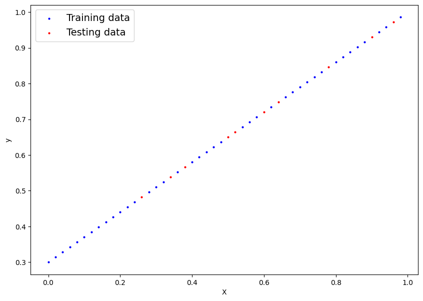
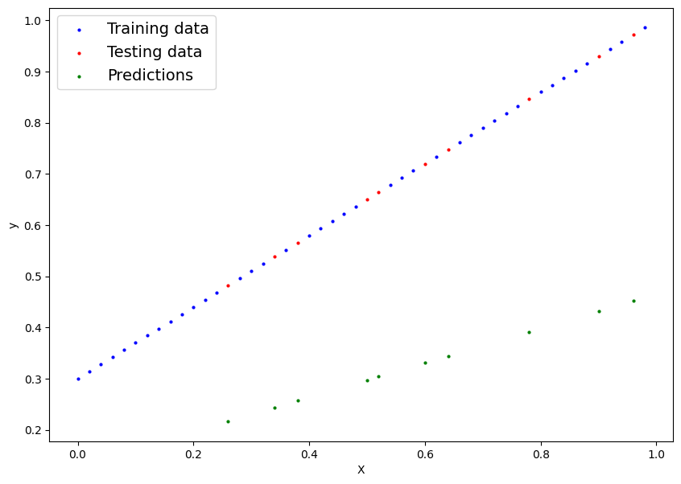
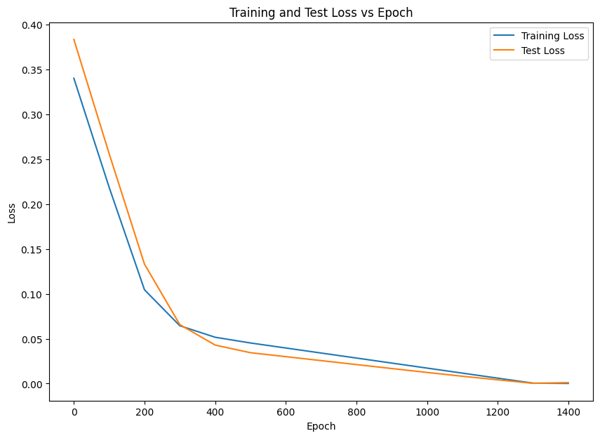

The objective is to use the very basic example of linear regression and use PyTorch to build a model to demonstrate Pytorch workflow and its fundementals.

```python
import torch
from torch import nn
import matplotlib.pyplot as plt
torch.__version__
```

    '2.4.1+cu121'

## Simple linear regression problem
I will use the freecodecamp example which I find very usefull to get into the fundementals. This will try to build a model which trains 2 variables; Bias and weight of a line. We will generate sample data with predefined values of .3 and .7 and train the model based on the sample data which we have generated.

### generate sample data


```python
# We will generate data based on the predefined weight and bias. this will generate a sample set of 5 values
weight = .7
bias = .3
start = 0
end = 1
step = .02
X = torch.arange(start, end, step).unsqueeze(dim=1)
print(X.shape)
y = weight * X + bias
X[:5] , y[:5]
```

    torch.Size([50, 1])


    (tensor([[0.0000],
             [0.0200],
             [0.0400],
             [0.0600],
             [0.0800]]),
     tensor([[0.3000],
             [0.3140],
             [0.3280],
             [0.3420],
             [0.3560]]))


```python
# prompt: split the data X and y for train and test at random positions

from sklearn.model_selection import train_test_split

X_train, X_test, y_train, y_test = train_test_split(
    X, y, test_size=0.2, random_state=42
)

print(f"X_train shape: {X_train.shape}")
print(f"y_train shape: {y_train.shape}")
print(f"X_test shape: {X_test.shape}")
print(f"y_test shape: {y_test.shape}")
```

    X_train shape: torch.Size([40, 1])
    y_train shape: torch.Size([40, 1])
    X_test shape: torch.Size([10, 1])
    y_test shape: torch.Size([10, 1])


### Visualize the sample data


```python
# prompt: visualize the X_train, X_test, y_train, y_test

plt.figure(figsize=(10, 7))
plt.scatter(X_train, y_train, c="b", s=4, label="Training data")
plt.scatter(X_test, y_test, c="r", s=4, label="Testing data")
plt.legend(fontsize=14)
plt.xlabel("X")
plt.ylabel("y")
plt.show()
```


    

    


## Model Development

So we need to build a model close to the above line and test the model on the red dots and get a result as close to it.

This is developed by inheriting the nn.Module class

***Step 1*** : initialize the paramters of bias and weight to a random value

***Step 2*** : Build a model using a custom funcion = X * weight + Bias.


```python
class LinearRegressionModelKFN(nn.Module):
    # The objective is to start with a random weight and bias and then usen the pytorch to figure out the best value based on the training data.
    # This is done either by gradient decent or Back propogation.
    # we have set requires_grad=True

    def __init__(self):
        super().__init__()
        self.weight = nn.Parameter(torch.randn(1, requires_grad=True, dtype=torch.float))
        self.bias = nn.Parameter(torch.randn(1, requires_grad=True, dtype=torch.float))

    # we need to overide the forward method
    def forward(self, x: torch.Tensor) -> torch.Tensor:
        return self.weight * x + self.bias
```

###  Initial random values of our model


```python
torch.manual_seed(42)
model_0 = LinearRegressionModelKFN()
print(list(model_0.parameters()))
print(model_0.state_dict())
with torch.inference_mode():
    y_preds = model_0(X_test)

y_preds
```

    [Parameter containing:
    tensor([0.3367], requires_grad=True), Parameter containing:
    tensor([0.1288], requires_grad=True)]
    OrderedDict([('weight', tensor([0.3367])), ('bias', tensor([0.1288]))])


    tensor([[0.2163],
            [0.3914],
            [0.3308],
            [0.4318],
            [0.2433],
            [0.4520],
            [0.3039],
            [0.2972],
            [0.3443],
            [0.2568]])


### Ploting the initial model with random parameters

We need to use pytorch to bring the green line as close to the red line


```python
# prompt: add to the plt the y_preds

plt.figure(figsize=(10, 7))
plt.scatter(X_train, y_train, c="b", s=4, label="Training data")
plt.scatter(X_test, y_test, c="r", s=4, label="Testing data")
plt.scatter(X_test, y_preds, c="g",  s=4, label="Predictions")
plt.legend(fontsize=14)
plt.xlabel("X")
plt.ylabel("y")
plt.show()

```


    

    


## Pytorch Workflow

We will define a loss function and a optimizer and iteratively use them to enhance the model by reducing the loss function.

We will also track the progress of the loss function


```python
# prompt: set a lossfunction using L1Loss and a Optimizer using SGD
loss_fn = nn.L1Loss()
optimizer = torch.optim.SGD(params = model_0.parameters(), lr=0.001)

# variable as used to iterate the number of time.
epochs = 1500

# Below variables are used to track the progress
epoch_values = []
loss_values = []
test_loss_values = []

# Workflow
for epoch in range(epochs):
    # set the model into training mode
    model_0.train()

    # Step 1: Forward Pass
    y_preds = model_0(X_train)

    # Step 2: Calculate the loss
    loss = loss_fn(y_preds, y_train)

    # Step 3: Opimizer zero grad to reset every loop
    optimizer.zero_grad()

    # Step 4: Perform back propogation
    loss.backward()

    # Step 5: Step the optimizer
    optimizer.step()


    # Progress tracking
    if epoch % 100 == 0:
      print(f"Epoch: {epoch} | Loss: {loss}")
      model_0.eval()
      print(model_0.state_dict())
      with torch.inference_mode():
        test_preds = model_0(X_test)
        test_loss = loss_fn(test_preds, y_test)
      epoch_values.append(epoch)
      loss_values.append(loss.detach().numpy())
      test_loss_values.append(test_loss.detach().numpy())

```

    Epoch: 0 | Loss: 0.340311199426651
    OrderedDict([('weight', tensor([0.3372])), ('bias', tensor([0.1298]))])
    Epoch: 100 | Loss: 0.21864144504070282
    OrderedDict([('weight', tensor([0.3837])), ('bias', tensor([0.2298]))])
    Epoch: 200 | Loss: 0.10451823472976685
    OrderedDict([('weight', tensor([0.4301])), ('bias', tensor([0.3256]))])
    Epoch: 300 | Loss: 0.06448396295309067
    OrderedDict([('weight', tensor([0.4709])), ('bias', tensor([0.3713]))])
    Epoch: 400 | Loss: 0.05163732171058655
    OrderedDict([('weight', tensor([0.5030])), ('bias', tensor([0.3857]))])
    Epoch: 500 | Loss: 0.045265451073646545
    OrderedDict([('weight', tensor([0.5278])), ('bias', tensor([0.3827]))])
    Epoch: 600 | Loss: 0.03966418653726578
    OrderedDict([('weight', tensor([0.5492])), ('bias', tensor([0.3727]))])
    Epoch: 700 | Loss: 0.03406292945146561
    OrderedDict([('weight', tensor([0.5707])), ('bias', tensor([0.3627]))])
    Epoch: 800 | Loss: 0.028461668640375137
    OrderedDict([('weight', tensor([0.5921])), ('bias', tensor([0.3527]))])
    Epoch: 900 | Loss: 0.02286040410399437
    OrderedDict([('weight', tensor([0.6136])), ('bias', tensor([0.3427]))])
    Epoch: 1000 | Loss: 0.0172591470181942
    OrderedDict([('weight', tensor([0.6351])), ('bias', tensor([0.3327]))])
    Epoch: 1100 | Loss: 0.011657887138426304
    OrderedDict([('weight', tensor([0.6565])), ('bias', tensor([0.3227]))])
    Epoch: 1200 | Loss: 0.006066909525543451
    OrderedDict([('weight', tensor([0.6776])), ('bias', tensor([0.3121]))])
    Epoch: 1300 | Loss: 0.0004846327065024525
    OrderedDict([('weight', tensor([0.6984])), ('bias', tensor([0.3009]))])
    Epoch: 1400 | Loss: 0.00019141807570122182
    OrderedDict([('weight', tensor([0.7002])), ('bias', tensor([0.3009]))])


### Plotting the progress tracking


```python
# prompt: Plot to compare epoch_values with loss_values and test_loss_values

plt.figure(figsize=(10, 7))
plt.plot(epoch_values, loss_values, label="Training Loss")
plt.plot(epoch_values, test_loss_values, label="Test Loss")
plt.xlabel("Epoch")
plt.ylabel("Loss")
plt.title("Training and Test Loss vs Epoch")
plt.legend()
plt.show()

```


    

    


Plotting the model output predictions


```python
# prompt: plot the new y_preds along with the Xtrain and X test
model_0.eval()
print(model_0.state_dict())
with torch.inference_mode():
    y_preds = model_0(X_test)

plt.figure(figsize=(10, 7))
plt.scatter(X_train, y_train, c="b", s=4, label="Training data")
plt.scatter(X_test, y_test, c="r", s=20, label="Testing data")
plt.scatter(X_test, y_preds, c="g",  s=4, label="Predictions")
plt.legend(fontsize=14)
plt.xlabel("X")
plt.ylabel("y")
plt.show()

```

    OrderedDict([('weight', tensor([0.6998])), ('bias', tensor([0.2999]))])


