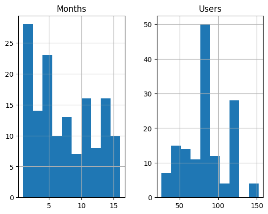
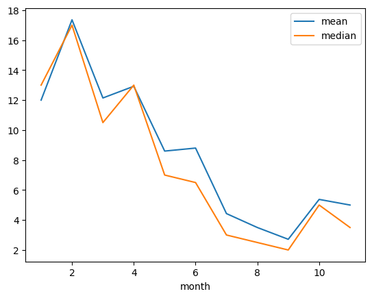
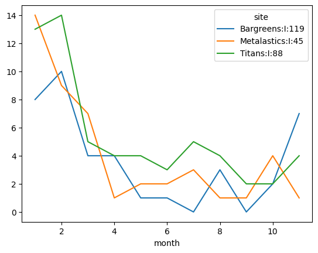
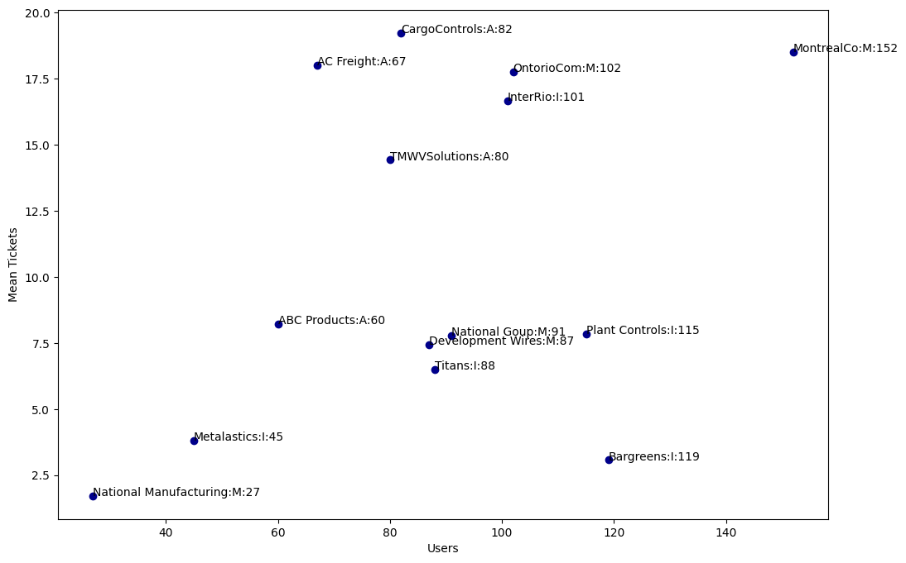
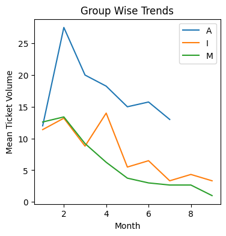
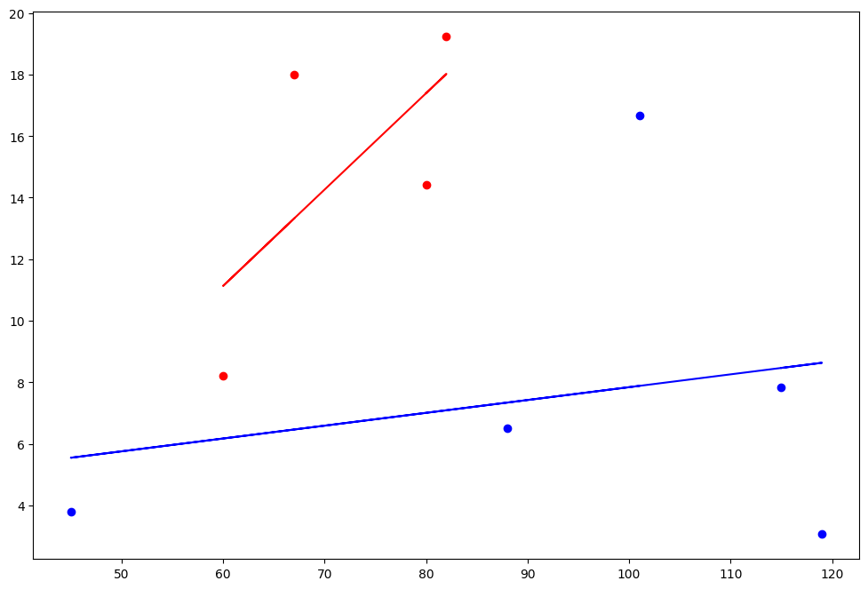
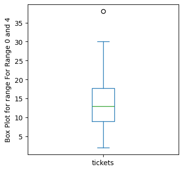
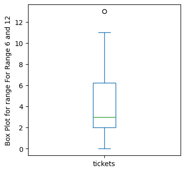
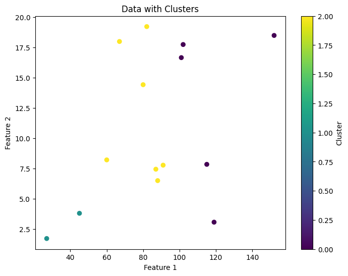
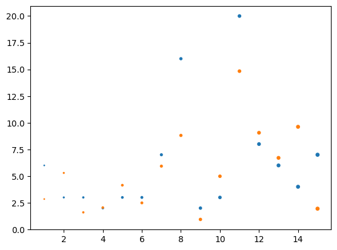

# Machine Learning for daily tasks
I was tasked with planning demand for tickets for a complex Application Maintenance System that supports multiple companies. 
There was some historical data available, and it was invaluable. 
Using machine learning with sklearn, we were able to predict ticket volumes on a monthly basis with a very high degree of accuracy.
Going through the usecase


```python
import pandas as pd
import numpy as np
from pandas import DataFrame
from pandas.plotting import scatter_matrix
import matplotlib.pyplot as plt
from statsmodels import robust
from sklearn.cluster import KMeans
from sklearn.linear_model import LinearRegression
csv_path = "AMS_out_v4.csv"
dataframe = pd.read_csv(csv_path)
```

# Data Discovery:
## Quick look at the data
The data is a  list of incedent tickets a company had raised after they adopted a COTS software product for every month after go live. 
Below is a sample of the data and a table that descibes data with row count, pencetile ranges, Max, Mins


```python
dataframe.sample(10)
```


<div>
<style scoped>
    .dataframe tbody tr th:only-of-type {
        vertical-align: middle;
    }

    .dataframe tbody tr th {
        vertical-align: top;
    }

    .dataframe thead th {
        text-align: right;
    }
</style>
<table border="1" class="dataframe">
  <thead>
    <tr style="text-align: right;">
      <th></th>
      <th>Site</th>
      <th>Group</th>
      <th>Months</th>
      <th>Users</th>
      <th>tickets</th>
      <th>Site (Users)</th>
    </tr>
  </thead>
  <tbody>
    <tr>
      <th>111</th>
      <td>Titans</td>
      <td>I</td>
      <td>13</td>
      <td>88</td>
      <td>15</td>
      <td>Titans:I:88</td>
    </tr>
    <tr>
      <th>87</th>
      <td>Bargreens</td>
      <td>I</td>
      <td>7</td>
      <td>119</td>
      <td>0</td>
      <td>Bargreens:I:119</td>
    </tr>
    <tr>
      <th>8</th>
      <td>ABC Products</td>
      <td>A</td>
      <td>11</td>
      <td>60</td>
      <td>3</td>
      <td>ABC Products:A:60</td>
    </tr>
    <tr>
      <th>28</th>
      <td>ABC Products</td>
      <td>A</td>
      <td>2</td>
      <td>60</td>
      <td>24</td>
      <td>ABC Products:A:60</td>
    </tr>
    <tr>
      <th>10</th>
      <td>ABC Products</td>
      <td>A</td>
      <td>13</td>
      <td>60</td>
      <td>10</td>
      <td>ABC Products:A:60</td>
    </tr>
    <tr>
      <th>29</th>
      <td>ABC Products</td>
      <td>A</td>
      <td>3</td>
      <td>60</td>
      <td>9</td>
      <td>ABC Products:A:60</td>
    </tr>
    <tr>
      <th>79</th>
      <td>Titans</td>
      <td>I</td>
      <td>4</td>
      <td>88</td>
      <td>4</td>
      <td>Titans:I:88</td>
    </tr>
    <tr>
      <th>66</th>
      <td>Development Wires</td>
      <td>M</td>
      <td>6</td>
      <td>87</td>
      <td>6</td>
      <td>Development Wires:M:87</td>
    </tr>
    <tr>
      <th>119</th>
      <td>Metalastics</td>
      <td>I</td>
      <td>1</td>
      <td>45</td>
      <td>14</td>
      <td>Metalastics:I:45</td>
    </tr>
    <tr>
      <th>118</th>
      <td>Bargreens</td>
      <td>I</td>
      <td>2</td>
      <td>119</td>
      <td>10</td>
      <td>Bargreens:I:119</td>
    </tr>
  </tbody>
</table>
</div>


```python
dataframe.describe()
```


<div>
<style scoped>
    .dataframe tbody tr th:only-of-type {
        vertical-align: middle;
    }

    .dataframe tbody tr th {
        vertical-align: top;
    }

    .dataframe thead th {
        text-align: right;
    }
</style>
<table border="1" class="dataframe">
  <thead>
    <tr style="text-align: right;">
      <th></th>
      <th>Months</th>
      <th>Users</th>
      <th>tickets</th>
    </tr>
  </thead>
  <tbody>
    <tr>
      <th>count</th>
      <td>145.000000</td>
      <td>145.000000</td>
      <td>145.000000</td>
    </tr>
    <tr>
      <th>mean</th>
      <td>7.172414</td>
      <td>83.172414</td>
      <td>9.689655</td>
    </tr>
    <tr>
      <th>std</th>
      <td>4.611798</td>
      <td>27.544243</td>
      <td>7.939456</td>
    </tr>
    <tr>
      <th>min</th>
      <td>1.000000</td>
      <td>27.000000</td>
      <td>0.000000</td>
    </tr>
    <tr>
      <th>25%</th>
      <td>3.000000</td>
      <td>67.000000</td>
      <td>3.000000</td>
    </tr>
    <tr>
      <th>50%</th>
      <td>6.000000</td>
      <td>82.000000</td>
      <td>8.000000</td>
    </tr>
    <tr>
      <th>75%</th>
      <td>11.000000</td>
      <td>101.000000</td>
      <td>15.000000</td>
    </tr>
    <tr>
      <th>max</th>
      <td>16.000000</td>
      <td>152.000000</td>
      <td>38.000000</td>
    </tr>
  </tbody>
</table>
</div>


```python
dataframe[['Months','Users']].hist()
plt.show();
```


    

    


# LOCATION ANALYSIS
## Basic Location Estimates:
First we need to learn about the data we have. We do a basic location analysis (Typical Values of or data)


```python
print(f"The mean number of tickets per month from a company: {dataframe['tickets'].mean()}")
print(f"The median number of tickets per month from a company: {dataframe['tickets'].median()}")
```

    The mean number of tickets per month from a company: 9.689655172413794
    The median number of tickets per month from a company: 8.0


## Estimates based on Month from inception:
The Mean and Median of the number of tickets from the first month onwards
Observation: We see that there is an initial surge during the first few months of go live and then after the system stabalizes, ticket volum tapers down.


```python
locationAnalysis=[];
for i in range (1,12):
    analysis_dataframe_month = dataframe[dataframe['Months'] == i]
    mean = analysis_dataframe_month['tickets'].mean();
    median = analysis_dataframe_month['tickets'].median();
    locationAnalysis.append([i,mean,median]);
fig, ax = plt.subplots()
df = pd.DataFrame(locationAnalysis, columns=['month', 'mean','median'])
df.plot(x='month', ax=ax)
plt.show()
```


    

    


## Trend Analysis from sample companies
Ticket volumes for sample companies based month wise from inception.
The inital surge and tappering down after stablization is evident even for inividual companies.


```python
def add_values(row):
    return row['Site'] + ":" + row['Group']  + ":" + str(row['Users'])

siteDictionary={};
columnsForPlotting=["Months"];
dataframe['Site (Users)'] = dataframe.apply(add_values, axis=1)
for ind in dataframe.index:
    if dataframe['Site (Users)'][ind] not in siteDictionary.keys():
        # this will have key=month and value=ticketCount
        ticketsDictionary={dataframe['Months'][ind] : dataframe['tickets'][ind]};
            # this will have key=SiteUser and value=ticketsDictionary
        siteDictionary[dataframe['Site (Users)'][ind]]=ticketsDictionary;
        columnsForPlotting.append(dataframe['Site (Users)'][ind]);
    else:
        ticketsDictionary=siteDictionary.get(dataframe['Site (Users)'][ind]);
        ticketsDictionary[dataframe['Months'][ind]]=dataframe['tickets'][ind];
    
tArray=[];
for site in columnsForPlotting[1:]:
    ticketsDictionary=siteDictionary.get(site);
    for month in range(1,12):
        if month in ticketsDictionary.keys():
            tArray.append([site,month,ticketsDictionary.get(month)]);
        else:
            tArray.append([site,month,'']);

df2 = pd.DataFrame(tArray,columns=['site', 'month', 'tickets'])
df2 = df2.pivot(index='month', columns='site', values='tickets')

fig, ax = plt.subplots()
df2.plot(ax=ax)
plt.show()
```


    

    


## Estimates based on user size:
Scatter plot is used to indicate the ticket volume and company user size. 


```python
def makeDFWithMeanMedian(dataframe:DataFrame) -> DataFrame:
    # The plot generated has named values.
    # Converted a tupple to a data frame
    dictionaryDF={};
    for ind in dataframe.index:
        if dataframe['Users'][ind] not in dictionaryDF.keys():
            tickets=[dataframe['Site (Users)'][ind],dataframe['tickets'][ind]];
            dictionaryDF[dataframe['Users'][ind]]=tickets;
        else:
            tickets = dictionaryDF.get(dataframe['Users'][ind]);
            tickets.append(dataframe['tickets'][ind]);
    
    locations=[];
    for key,value in dictionaryDF.items():
        # appending a tupple to the list which is needed to change to dataframe easily
        locations.append((key,value[0],np.mean(value[1:]),np.median(value[1:])));
    # values,  # 1st column as index # 1st row as the column names
    # print(locations);
    newDataFrame = pd.DataFrame(locations, columns =['Users', 'Site (Users)', 'mean','median']);
    return newDataFrame;

newDataFrame=makeDFWithMeanMedian(dataframe)
# open figure + axis
fig, ax = plt.subplots()
fig.set_size_inches(12, 8)
    # plot
ax.scatter(x=newDataFrame['Users'],y=newDataFrame['mean'],c='DarkBlue')
# set labels
ax.set_xlabel('Users')
ax.set_ylabel('Mean Tickets')

# annotate points in axis   
for idx, row in newDataFrame.iterrows():
    ax.annotate(row['Site (Users)'], (row['Users'], row['mean']) )
# force matplotlib to draw the graph
plt.show()
```


    

    


## LocationAnalysis: User Size and Group
Since there is the group impacts.


```python
dataframe1=dataframe[dataframe['Group'] == 'A'];
dataframe2=dataframe[dataframe['Group'] == 'M'];
dataframe3=dataframe[dataframe['Group'] == 'I'];
dictionary={'A':dataframe1,'I':dataframe2,'M':dataframe3};
fig, ax = plt.subplots()
fig.set_size_inches(4, 4)
for key, dataframein in dictionary.items():
    locationAnalysis=[];
    flag = True;
    for i in range (1,10):
        analysis_dataframe_month = dataframein[dataframein['Months'] == i]
        mean = analysis_dataframe_month['tickets'].mean();
        locationAnalysis.append([i,mean]);
    df = pd.DataFrame(locationAnalysis, columns=['month', 'mean'])
    df=df.rename(columns={"mean": key})
    df.plot(x='month',ax=ax)
plt.ylabel('Mean Ticket Volume')
plt.xlabel('Month')
plt.title('Group Wise Trends')
plt.show();
```


    

    


## Company Variant Analysis
Since the tickets are impacted by the type of compamy group they belong to, 
we are ploting a linar line to deomstrate the same


```python
dataframe1=dataframe[dataframe['Group'] == 'A'];
newDataFrame=makeDFWithMeanMedian(dataframe1)
regressor = LinearRegression();
regressor.fit(newDataFrame[['Users']],newDataFrame[['mean']])
fig, ax = plt.subplots()
plt.scatter(newDataFrame['Users'],newDataFrame['mean'], color='red')
plt.plot(newDataFrame['Users'], regressor.predict(newDataFrame[['Users']]),color='red')
fig.set_size_inches(12, 8)
dataframe1=dataframe[dataframe['Group'] == 'I'];
newDataFrame=makeDFWithMeanMedian(dataframe1)
regressor = LinearRegression();
regressor.fit(newDataFrame[['Users']],newDataFrame[['mean']])
plt.scatter(newDataFrame['Users'],newDataFrame['mean'], color='blue')
plt.plot(newDataFrame['Users'], regressor.predict(newDataFrame[['Users']]),color='blue')
```


    [<matplotlib.lines.Line2D at 0x135c1e890>]


    

    


### Data Variability & Distribution Analysis For Range 0 - 4 Months and 6 -12 Months


```python
def dataVariabilityAnalysisInitialSurge(dataframe:DataFrame,  start:int, end:int):
    print(f"Data Variability Analysis For Range {start} and {end}")
    dataframe = dataframe[dataframe['Months'] > start]
    analysis_dataframe_month = dataframe[dataframe['Months'] < end]
    #print(analysis_dataframe_month);
    standardDeviation = analysis_dataframe_month['tickets'].std()
    print(f"Standard Deviation: {standardDeviation}")
    interQuartilerange= analysis_dataframe_month['tickets'].quantile(0.75) - analysis_dataframe_month['tickets'].quantile(0.25)
    print(f"Inter Quartile Range (difference between the 25th percentile and the 75th percentile): {interQuartilerange}")
    robustMAD=robust.scale.mad(analysis_dataframe_month['tickets'])
    print(f"The robust mean absolute deviation:{robustMAD}")
    percentile = analysis_dataframe_month['Months'].quantile([0.05, 0.25, 0.5, 0.75, 0.95])
    print(f"Distribution Analysis For Range {start} and {end}")
    print(f"Percentile 0.05, 0.25, 0.5, 0.75, 0.95 \n{percentile}")
    fig = plt.figure() 
    fig.set_size_inches(4, 4)
    ax = (analysis_dataframe_month['tickets']).plot.box()
    label = f"Box Plot for range For Range {start} and {end}";
    ax.set_ylabel(label)
    plt.show()
dataVariabilityAnalysisInitialSurge(dataframe, 0, 4);
```

    Data Variability Analysis For Range 0 and 4
    Standard Deviation: 7.751999479809022
    Inter Quartile Range (difference between the 25th percentile and the 75th percentile): 8.75
    The robust mean absolute deviation:6.671709983275209
    Distribution Analysis For Range 0 and 4
    Percentile 0.05, 0.25, 0.5, 0.75, 0.95 
    0.05    1.0
    0.25    1.0
    0.50    2.0
    0.75    3.0
    0.95    3.0
    Name: Months, dtype: float64


    

    


```python
dataVariabilityAnalysisInitialSurge(dataframe, 6, 12)
```

    Data Variability Analysis For Range 6 and 12
    Standard Deviation: 3.3942060810497234
    Inter Quartile Range (difference between the 25th percentile and the 75th percentile): 4.25
    The robust mean absolute deviation:2.965204437011204
    Distribution Analysis For Range 6 and 12
    Percentile 0.05, 0.25, 0.5, 0.75, 0.95 
    0.05     7.0
    0.25     8.0
    0.50     9.0
    0.75    10.0
    0.95    11.0
    Name: Months, dtype: float64


    

    


## doGroupUserAnalysis


```python
newDataFrame=makeDFWithMeanMedian(dataframe);
print(newDataFrame);
newDataFrame = newDataFrame.drop(['Site (Users)','median'], axis=1)
kmeans = KMeans(n_clusters=3, random_state=42);
# Fit the model to your data
X=newDataFrame.to_numpy();
cluster_labels = kmeans.fit_predict(X);

# Create a scatter plot for the first two features
fig=plt.figure(figsize=(8, 6))
plt.scatter(X[:, 0], X[:, 1], c=cluster_labels, cmap='viridis')
plt.xlabel('Feature 1')
plt.ylabel('Feature 2')
plt.title('Data with Clusters')
plt.colorbar(label='Cluster')
plt.show();
```

        Users                 Site (Users)       mean  median
    0      67              AC Freight:A:67  18.000000    17.0
    1      60            ABC Products:A:60   8.214286     7.0
    2      82           CargoControls:A:82  19.230769    19.0
    3      80           TMWVSolutions:A:80  14.428571    15.0
    4      27  National Manufacturing:M:27   1.714286     2.0
    5      87       Development Wires:M:87   7.444444     6.0
    6      91           National Goup:M:91   7.777778     7.0
    7     115         Plant Controls:I:115   7.846154     6.0
    8     119              Bargreens:I:119   3.066667     2.0
    9      88                  Titans:I:88   6.500000     4.5
    10     45             Metalastics:I:45   3.800000     2.0
    11    152             MontrealCo:M:152  18.500000    20.0
    12    102             OntorioCom:M:102  17.750000    19.5
    13    101               InterRio:I:101  16.666667    16.0


    

    


# Prediction
We used a simple pipeline with Support Vector Regression (SVR) to predict ticket volumes. 
By considering user count, group type, and the number of companies that had gone live or were stable in the past few months, we were able to accurately forecast the number of tickets each month. 
This approach was also very useful for predicting ticket volumes for a company during its first few months, assessing system stability during hypercare, and determining readiness for transition.


```python
import numpy as np 
import matplotlib.pyplot as plt 
import pandas as pd
from sklearn.svm import SVR
from sklearn.model_selection import train_test_split
from sklearn.metrics import mean_squared_error, r2_score
from sklearn.preprocessing import StandardScaler
from sklearn.preprocessing import PolynomialFeatures
from sklearn.linear_model import LinearRegression
from sklearn.model_selection import GridSearchCV, cross_val_score
from sklearn.pipeline import Pipeline
from sklearn.compose import ColumnTransformer
from xgboost import XGBClassifier
from sklearn.preprocessing import OneHotEncoder
from sklearn.model_selection import cross_validate, StratifiedKFold
dataset = pd.read_csv('AMS_out_v4.csv')
```


```python
X_train, X_test, y_train, y_test = train_test_split(dataset[['Months','Users','Group']], dataset['tickets'].values, test_size=0.1, random_state=99)

multicolumn_prep = ColumnTransformer([
                                    ('encode', OneHotEncoder(sparse_output=False, handle_unknown='ignore'), ['Group']),
                                    ('scaler', StandardScaler(), ['Months','Users'])
                                    ],
                                     remainder='passthrough')
space_titanic_pipeline = Pipeline([('preprocessing', multicolumn_prep),
                                    ('model',SVR(kernel="rbf", C=100, gamma="auto",epsilon=0.0001, coef0 =0.001,degree=2))])

model = space_titanic_pipeline.fit(X_train, y_train);
y_svr_pred = model.predict(X_test);

temp = pd.DataFrame();
temp = X_test;
temp['Actual']=y_test
temp['Predicted']=y_svr_pred

def analyzeReults(y_test,y_pred):
    rmse = np.sqrt(mean_squared_error(y_test,y_pred))
    print(f"The root mean square error is {rmse}");
    r2 = r2_score(y_test,y_pred)
    print(f"The r2 score is {r2}");
    resultActualDF=pd.DataFrame()
    resultPredDF=pd.DataFrame()
    index = np.arange(start=1, stop= len(y_test)+1)
    pd.Series(index);
    resultActualDF["tickets"] = y_test;
    resultPredDF["tickets"]= y_pred;
    plt.scatter(pd.Series(index), resultActualDF,pd.Series(index))
    plt.scatter(pd.Series(index), resultPredDF,pd.Series(index))
    plt.show(); 


analyzeReults(y_test,y_svr_pred);

scores = cross_val_score(model, X_train, y_train, scoring="r2", cv=8)
print(f"scores:{scores}")
print(f"mean score {scores.mean()}")
print(f"std deviation of score {scores.std()}");
print("Comparing Actual and Predicted.")
temp

```

    The root mean square error is 3.2867599548019504
    The r2 score is 0.5762503530142633


    

    


    scores:[0.38391399 0.58976798 0.52677144 0.46689801 0.28780864 0.69530423
     0.41316553 0.4792549 ]
    mean score 0.4803605905328669
    std deviation of score 0.11800453109629407


<div>
<style scoped>
    .dataframe tbody tr th:only-of-type {
        vertical-align: middle;
    }

    .dataframe tbody tr th {
        vertical-align: top;
    }

    .dataframe thead th {
        text-align: right;
    }
</style>
<table border="1" class="dataframe">
  <thead>
    <tr style="text-align: right;">
      <th></th>
      <th>Months</th>
      <th>Users</th>
      <th>Group</th>
      <th>Actual</th>
      <th>Predicted</th>
    </tr>
  </thead>
  <tbody>
    <tr>
      <th>101</th>
      <td>16</td>
      <td>115</td>
      <td>I</td>
      <td>6</td>
      <td>2.847273</td>
    </tr>
    <tr>
      <th>8</th>
      <td>11</td>
      <td>60</td>
      <td>A</td>
      <td>3</td>
      <td>5.295125</td>
    </tr>
    <tr>
      <th>57</th>
      <td>2</td>
      <td>27</td>
      <td>M</td>
      <td>3</td>
      <td>1.600696</td>
    </tr>
    <tr>
      <th>98</th>
      <td>10</td>
      <td>119</td>
      <td>I</td>
      <td>2</td>
      <td>2.051616</td>
    </tr>
    <tr>
      <th>86</th>
      <td>6</td>
      <td>88</td>
      <td>I</td>
      <td>3</td>
      <td>4.144913</td>
    </tr>
    <tr>
      <th>81</th>
      <td>11</td>
      <td>115</td>
      <td>I</td>
      <td>3</td>
      <td>2.489424</td>
    </tr>
    <tr>
      <th>69</th>
      <td>7</td>
      <td>91</td>
      <td>M</td>
      <td>7</td>
      <td>5.933006</td>
    </tr>
    <tr>
      <th>131</th>
      <td>4</td>
      <td>115</td>
      <td>I</td>
      <td>16</td>
      <td>8.811666</td>
    </tr>
    <tr>
      <th>70</th>
      <td>7</td>
      <td>27</td>
      <td>M</td>
      <td>2</td>
      <td>0.939125</td>
    </tr>
    <tr>
      <th>9</th>
      <td>12</td>
      <td>60</td>
      <td>A</td>
      <td>3</td>
      <td>4.984632</td>
    </tr>
    <tr>
      <th>16</th>
      <td>13</td>
      <td>82</td>
      <td>A</td>
      <td>20</td>
      <td>14.834038</td>
    </tr>
    <tr>
      <th>4</th>
      <td>14</td>
      <td>67</td>
      <td>A</td>
      <td>8</td>
      <td>9.062198</td>
    </tr>
    <tr>
      <th>64</th>
      <td>5</td>
      <td>87</td>
      <td>M</td>
      <td>6</td>
      <td>6.707223</td>
    </tr>
    <tr>
      <th>120</th>
      <td>3</td>
      <td>119</td>
      <td>I</td>
      <td>4</td>
      <td>9.618984</td>
    </tr>
    <tr>
      <th>102</th>
      <td>11</td>
      <td>119</td>
      <td>I</td>
      <td>7</td>
      <td>1.946395</td>
    </tr>
  </tbody>
</table>
</div>


