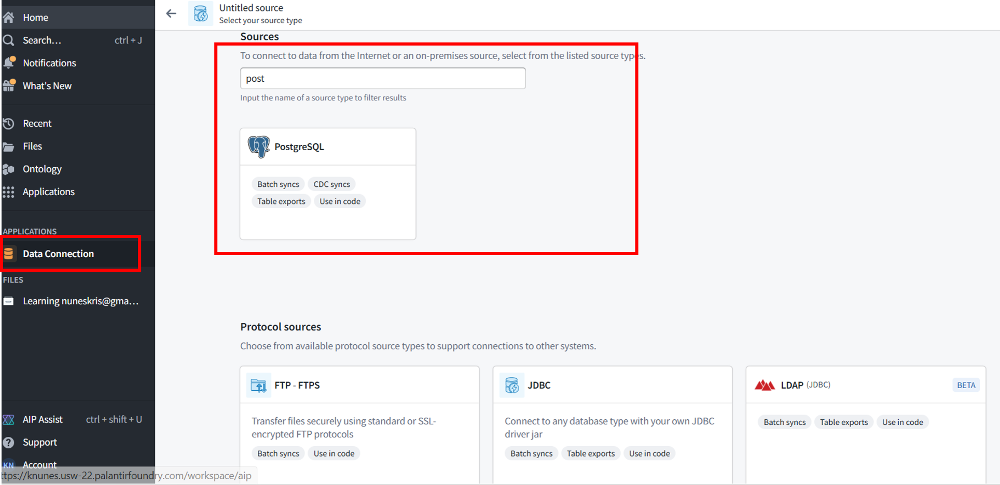
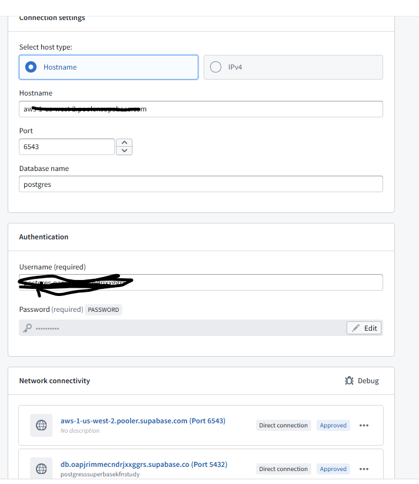
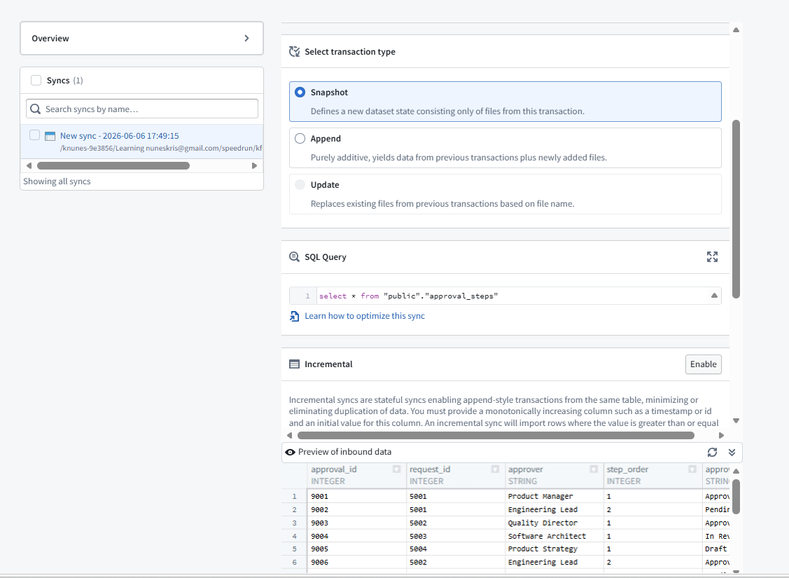
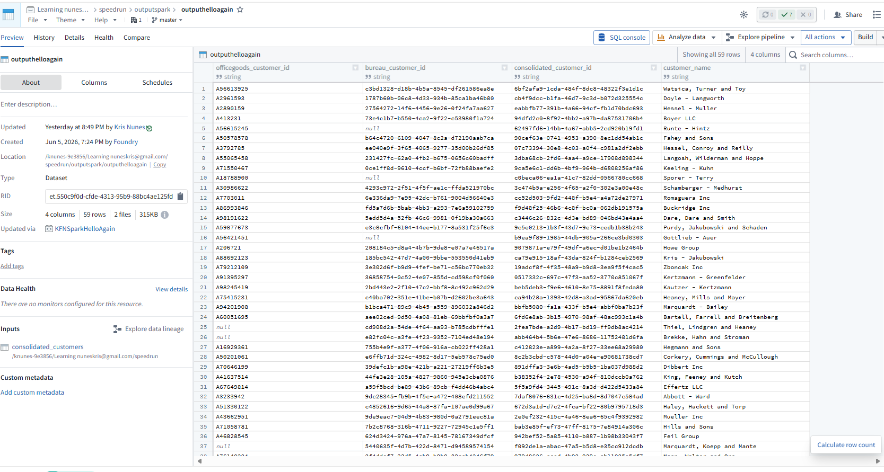

The objective is to build a fundemental ingest building block for ingest "Data Connection" in Palantir.

## Some Prep work. 

We need to host a DB (Postgres) and supabase.com to the rescue. I had used github cred to create a free account and load data into it.

### loading the data into the table

Providing the sql statements to explain the data

```sql
-- Sample PLM database schema and seed data
-- Use case: Product lifecycle management with products, versions, components, change requests, and approvals.

-- Drop tables if they exist (adjust syntax for your RDBMS if needed)
DROP TABLE IF EXISTS approval_steps;
DROP TABLE IF EXISTS change_requests;
DROP TABLE IF EXISTS product_components;
DROP TABLE IF EXISTS product_versions;
DROP TABLE IF EXISTS products;

-- Product master table
CREATE TABLE products (
    product_id INT PRIMARY KEY,
    product_code VARCHAR(20) NOT NULL,
    product_name VARCHAR(100) NOT NULL,
    product_family VARCHAR(50),
    lifecycle_stage VARCHAR(30) NOT NULL,
    created_at DATE NOT NULL
);

-- Product version table representing released revisions
CREATE TABLE product_versions (
    version_id INT PRIMARY KEY,
    product_id INT NOT NULL,
    version_label VARCHAR(20) NOT NULL,
    release_date DATE,
    status VARCHAR(30) NOT NULL,
    description VARCHAR(200),
    FOREIGN KEY (product_id) REFERENCES products(product_id)
);

-- Product component bill of materials
CREATE TABLE product_components (
    component_id INT PRIMARY KEY,
    version_id INT NOT NULL,
    component_code VARCHAR(30) NOT NULL,
    component_name VARCHAR(100) NOT NULL,
    quantity INT NOT NULL,
    supplier VARCHAR(100),
    lifecycle_status VARCHAR(30) NOT NULL,
    FOREIGN KEY (version_id) REFERENCES product_versions(version_id)
);

-- Change request table for product/version changes
CREATE TABLE change_requests (
    request_id INT PRIMARY KEY,
    product_id INT NOT NULL,
    version_id INT,
    request_type VARCHAR(50) NOT NULL,
    request_title VARCHAR(150) NOT NULL,
    requested_by VARCHAR(100) NOT NULL,
    requested_date DATE NOT NULL,
    target_release_date DATE,
    request_status VARCHAR(30) NOT NULL,
    priority VARCHAR(20) NOT NULL,
    description TEXT,
    FOREIGN KEY (product_id) REFERENCES products(product_id),
    FOREIGN KEY (version_id) REFERENCES product_versions(version_id)
);

-- Approval workflow steps for change requests
CREATE TABLE approval_steps (
    approval_id INT PRIMARY KEY,
    request_id INT NOT NULL,
    approver VARCHAR(100) NOT NULL,
    step_order INT NOT NULL,
    approval_status VARCHAR(30) NOT NULL,
    decision_date DATE,
    comments VARCHAR(250),
    FOREIGN KEY (request_id) REFERENCES change_requests(request_id)
);

-- Seed data for products
INSERT INTO products (product_id, product_code, product_name, product_family, lifecycle_stage, created_at) VALUES
(1, 'PLM-1000', 'Smart Sensor Platform', 'IoT', 'Development', '2025-01-15'),
(2, 'PLM-2000', 'Industrial Gateway', 'Edge Systems', 'Release', '2024-08-01'),
(3, 'PLM-3000', 'Mobile App Suite', 'Software', 'Maintenance', '2023-11-20'),
(4, 'PLM-4000', 'Smart Factory Controller', 'Automation', 'Release', '2024-05-08'),
(5, 'PLM-5000', 'AR Maintenance Assistant', 'AR/VR', 'Concept', '2025-02-12');

-- Seed data for product versions
INSERT INTO product_versions (version_id, product_id, version_label, release_date, status, description) VALUES
(101, 1, 'v0.9', NULL, 'Prototype', 'Initial prototype for internal testing'),
(102, 1, 'v1.0', '2025-06-10', 'Planned', 'First commercial release planned'),
(103, 1, 'v1.1', '2025-09-30', 'Planned', 'Hardware and firmware release for next iteration'),
(201, 2, 'v1.0', '2024-11-12', 'Released', 'Initial production release'),
(202, 2, 'v1.1', '2025-03-05', 'Released', 'Minor update with stability fixes'),
(203, 2, 'v2.0', '2025-09-10', 'Planned', 'Major gateway update with new protocol support'),
(301, 3, 'v2.0', '2025-02-18', 'Released', 'Major mobile app update'),
(302, 3, 'v2.1', '2025-07-22', 'Released', 'Maintenance release with UX improvements'),
(401, 4, 'v1.0', '2024-10-01', 'Released', 'Initial factory controller release'),
(501, 5, 'alpha', '2025-12-01', 'Concept', 'Alpha release for AR maintenance assistant');

-- Seed data for product components
INSERT INTO product_components (component_id, version_id, component_code, component_name, quantity, supplier, lifecycle_status) VALUES
(1001, 101, 'SSP-MCU', 'Microcontroller Unit', 1, 'CoreChip Ltd', 'Approved'),
(1002, 101, 'SSP-SENSOR', 'Multi-sensor Array', 1, 'SenseMakers Inc', 'Approved'),
(1003, 101, 'SSP-HOUS', 'Enclosure', 1, 'PlasticWorks', 'Approved'),
(1004, 102, 'SSP-BATT', 'Rechargeable Battery', 1, 'PowerCell Co', 'Under Review'),
(1010, 102, 'SSP-FIRM', 'Firmware Package', 1, 'In-house', 'Under Review'),
(1011, 103, 'SSP-CASE', 'Rugged Enclosure', 1, 'ArmorPack', 'Proposed'),
(1005, 201, 'IGW-CPU', 'Gateway CPU Board', 1, 'EdgeLogic', 'Approved'),
(1006, 201, 'IGW-ANT', 'Antenna Assembly', 2, 'SignalWave', 'Approved'),
(1007, 202, 'IGW-GBL', 'Gateway Bluetooth Module', 1, 'BlueLink', 'Approved'),
(1012, 203, 'IGW-SEC', 'Security Module', 1, 'SafeNet', 'Approved'),
(1013, 203, 'IGW-PSU', 'Power Supply', 1, 'VoltPower', 'Approved'),
(1008, 301, 'APP-UI', 'Mobile App UI Module', 1, 'In-house', 'Approved'),
(1009, 301, 'APP-BACK', 'Backend Sync Service', 1, 'In-house', 'Approved'),
(1014, 302, 'APP-ANALYTICS', 'Analytics Engine', 1, 'In-house', 'Approved'),
(1015, 401, 'SFC-CPU', 'Controller CPU Board', 1, 'EdgeLogic', 'Approved'),
(1016, 401, 'SFC-IO', 'I/O Expansion Module', 4, 'ConnectCorp', 'Approved'),
(1017, 501, 'ARA-HMD', 'AR Headset', 1, 'VisionTech', 'Proposed'),
(1018, 501, 'ARA-SW', 'AR Software Core', 1, 'In-house', 'Proposed');

-- Seed data for change requests
INSERT INTO change_requests (request_id, product_id, version_id, request_type, request_title, requested_by, requested_date, target_release_date, request_status, priority, description) VALUES
(5001, 1, 102, 'Engineering Change', 'Update battery specification for longer runtime', 'Avery Johnson', '2025-03-25', '2025-05-20', 'Submitted', 'High', 'Switch to new battery supplier and update BOM documentation.'),
(5002, 2, 202, 'Quality Improvement', 'Replace antenna assembly with higher-gain unit', 'Mia Patel', '2025-01-10', '2025-02-28', 'Approved', 'Medium', 'Improves connectivity in remote installations.'),
(5003, 3, 301, 'Software Patch', 'Bug fix for data sync timeout', 'Noah Kim', '2025-04-02', '2025-04-30', 'In Review', 'High', 'Resolve intermittent timeouts for sync service on slow networks.'),
(5004, 1, NULL, 'New Feature', 'Add predictive maintenance analytics', 'Elena Rossi', '2025-04-18', '2025-08-01', 'Draft', 'Low', 'Introduce analytics dashboard in future release.'),
(5005, 4, 401, 'Regulatory Change', 'Update controller safety compliance labels', 'Priya Singh', '2025-01-20', '2025-04-15', 'Approved', 'High', 'Ensure factory controller meets latest CE and UL requirements.'),
(5006, 5, 501, 'Design Review', 'Refine AR overlay interaction flow', 'Jackson Lee', '2025-05-05', '2025-06-30', 'Submitted', 'Medium', 'Improve ease-of-use for maintenance technicians.'),
(5007, 2, 203, 'Engineering Change', 'Add secure boot support', 'Lena Chen', '2025-03-12', '2025-08-01', 'In Review', 'High', 'Required for new customer security standard.'),
(5008, 3, 302, 'Maintenance', 'Fix login crash on older OS versions', 'Amir Hassan', '2025-06-05', '2025-07-10', 'Approved', 'High', 'Critical bug affecting field technicians.'),
(5009, 1, 103, 'Engineering Change', 'Add edge analytics sensor calibration', 'Avery Johnson', '2025-05-01', '2025-09-15', 'Draft', 'Medium', 'Calibration logic for next version sensors.');

-- Seed data for approval steps
INSERT INTO approval_steps (approval_id, request_id, approver, step_order, approval_status, decision_date, comments) VALUES
(9001, 5001, 'Product Manager', 1, 'Approved', '2025-04-02', 'Battery life improvement is essential for launch.'),
(9002, 5001, 'Engineering Lead', 2, 'Pending', NULL, NULL),
(9003, 5002, 'Quality Director', 1, 'Approved', '2025-01-18', 'Antenna update meets customer needs.'),
(9004, 5003, 'Software Architect', 1, 'In Review', NULL, 'Need full regression test results.'),
(9005, 5004, 'Product Strategy', 1, 'Draft', NULL, 'Concept request under evaluation.'),
(9006, 5002, 'Engineering Lead', 2, 'Approved', '2025-01-25', 'Engineering has validated the antenna design.'),
(9007, 5003, 'QA Team', 2, 'Pending', NULL, 'Regression tests still running.'),
(9008, 5005, 'Compliance Lead', 1, 'Approved', '2025-02-02', 'Labels and documentation approved.'),
(9009, 5006, 'UX Lead', 1, 'In Review', NULL, 'Reviewing overlay behavior.'),
(9010, 5007, 'Security Director', 1, 'In Review', NULL, 'Secure boot implementation details needed.'),
(9011, 5008, 'Maintenance Manager', 1, 'Approved', '2025-06-20', 'Bug fix ready for deployment.'),
(9012, 5009, 'Engineering Lead', 1, 'Draft', NULL, 'Need BOM impact assessment.');
```

# Data Connection

this will be a one time connection configuration and we will use this later in a transform.



## Connection Details


Note: Ensure the egress network policies are appropriately added. [Typically managed by the platform admins]

## Test Run

Configure a sync and a target and we are good to go.




The output folder which was configured had the data ingested.

