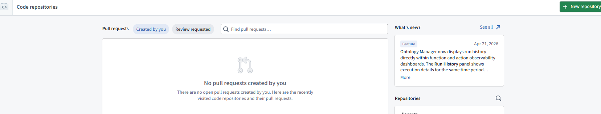
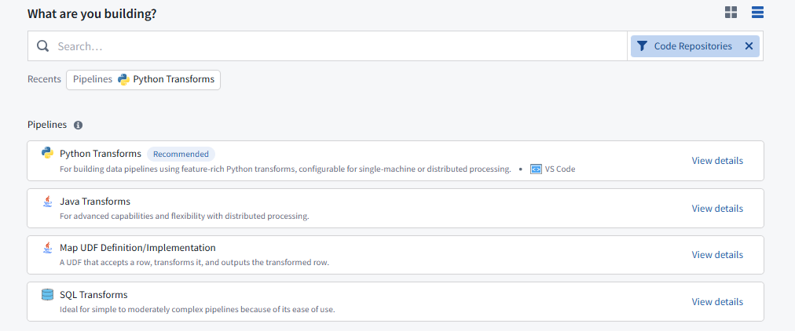
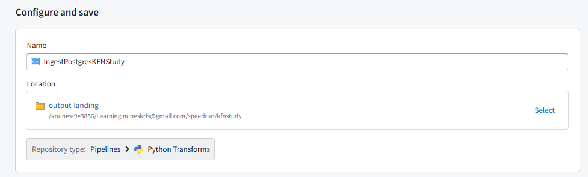
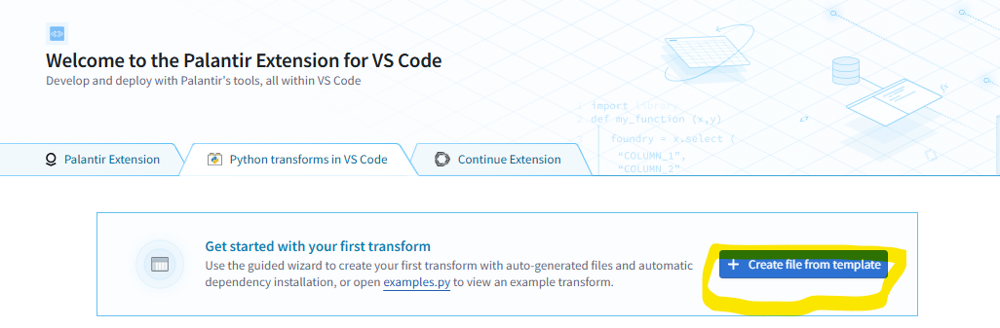
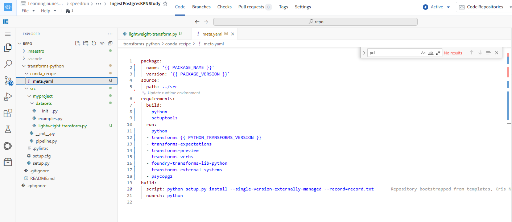

# Some intitial thoughts
- We will Use Python (Lightweight) for most ingestion use cases. It's simpler, faster to start up (no Spark overhead), and handles the vast majority of table sizes. This is what we will be building now with @external_systems + psycopg2.
- Use will PySpark only when you need Spark's distributed JDBC reader to parallelize reads across partitions for very large tables. Spark can split a single table read into multiple parallel queries using a partition column: We will try an demonstrate how we would achieve this in a later use case

We developed how to create a data connection


## Code Repository

Code Repository in Foundry

- A Code Repository is a Git-backed project that contains the logic for data transformations, functions, models, or applications. It's the fundamental unit where all "code" lives in Foundry.

- What It Contains
```
code-repository/
├── transforms-python/
│   ├── conda_recipe/
│   │   └── meta.yaml              ← Dependencies (packages)
│   └── src/
│       ├── myproject/
│       │   ├── pipeline.py         ← Registers transforms for discovery
│       │   └── datasets/
│       │       └── my_transform.py ← Your transform logic
│       ├── setup.py                ← Entry point declaration
│       └── test/                   ← Unit tests
├── build.gradle                    ← Build configuration
└── ci.yml                          ← CI pipeline definition
```






Give at a name and a folder where it needs to reside. Use the option to open via VSCode and now we are ready to go. They provide an option to use a template. 



Since I am starting out, using the template option.



Before we get into design, there is something which did escape me and create some confusion is below
### Registration and Runtime Layer 

```
┌─────────────────────────────────────────────────┐
│  REGISTRATION LAYER (static, fixed at check-in) │
│  → Input(), Output(), Source()                   │
├─────────────────────────────────────────────────┤
│  RUNTIME LAYER (configurable per build)          │
│  → StringParam(), IntegerParam(), BooleanParam() │
└─────────────────────────────────────────────────┘
```

#### 1. Output() — Where data goes
What it is: Declares the dataset that your transform will write to.

How to use it:
```python
output = Output("/my-project/data/clean-customers")
```
Limitations:
- Must be a fixed path or RID — cannot be dynamic
- One transform can have multiple outputs, but each must be declared explicitly
- The path is resolved when the code is registered (checked in), not at build time

#### 2. Input() — Where data comes from
What it is: Declares a Foundry dataset that your transform reads as input.

How to use it:
```python
db_config = Input("ri.foundry.main.dataset.ec675cfe-c4ac-4b43-b238-2528be816ce3")
# or
raw_data = Input("/my-project/data/raw-customers")
```
Limitations:
- Must be a fixed path or RID — cannot be dynamic
- Foundry uses this to build the dependency graph (knows what to build first)
- Cannot read from a dataset that isn't declared as an Input

#### 3. Source() / @external_systems — Connection to the outside world
What it is: Declares a connection to an external system (database, API, cloud storage) configured in Data Connection.

How to use it:
```python
@external_systems(postgresql_dc=Source("ri.magritte..source.312ffc80-xxxx"))
```
Limitations:
- Must be a fixed source RID — cannot be dynamic
- The source must already exist in Data Connection
- Security and network egress policies are tied to the source at registration
- You still need to write the query/fetch logic inside the function

#### 4. StringParam(), IntegerParam(), BooleanParam() — Runtime configuration
What they are: Configurable values that can be changed per build without modifying code.
How to use them:
```python
filter_column = StringParam("customer_name")   # default: "customer_name"
min_records = IntegerParam(100)                 # default: 100
include_nulls = BooleanParam(False)            # default: False
```
What they're good for:
- Controlling filter logic, thresholds, feature flags
- Changing table names or queries sent to an external system
- Toggling behavior without a code change

Limitations:
- Can only be used inside the transform function (runtime logic)
- Cannot be used to set Input(), Output(), or Source() paths
- Values are set at build time (via UI or schedule configuration)
- Types are limited to: String, Integer, Boolean


## Design

Now lets get to the design

I would like this to scale to mutiple tables and eventually multiple databases. First we will try multiple tables and then pivot


```
┌─────────────────────────────┐
│  Data Connection Source      │  ← PASSWORD
└─────────────────────────────┘

┌─────────────────────────────┐
│  Config Dataset (Foundry)    │  ← host, port, username, database (not in Git)
└─────────────────────────────┘

┌─────────────────────────────┐
│  Code Repository (internal)  │  ← Only logic + table_config.json
└─────────────────────────────┘
```

I chose to separate my PostgreSQL ingestion pipeline into three layers because I need to promote this to production, and I don't want sensitive infrastructure details leaking into Git.

### Why I'm using a Data Connection Source for credentials
I store my PostgreSQL username and password in Foundry's Data Connection Source because it's the platform's built-in secret store. Foundry encrypts these values, controls who can access them, and provides audit logging. When my transform runs, it calls get_secret("PASSWORD") at runtime — the actual credential never appears in my code or Git history. If I rotate my database password, I update it once in the source and all my transforms pick it up automatically without a code change.

>> Note: Since I am using my own code to connect, need to intall psycopg2. We mention this inside meta-yaml



also to execute the testing in the vscode we need to install the same

```
maestro env conda install psycopg2
```

### Why I'm using a config dataset for connection details
I don't want my database hostname, port, or database name in Git either. Even though these aren't secrets in the traditional sense, they reveal my infrastructure — where my database lives, what cloud provider I use, what port it's on. That's information I'd rather not have in version control. By storing it in a Foundry dataset, I can:
- Control who sees it with dataset-level permissions
- Change it without a code commit (e.g., if my Supabase instance migrates)
- Have different config datasets per environment (dev, staging, prod) without branching my code


### Why I'm using a JSON config file for table mappings
My table_config.json lists which PostgreSQL tables to ingest and where each one lands in Foundry. This IS something I want in Git because:
- It's not sensitive — table names like public.customers don't expose anything
- I want it reviewed in PRs when someone adds a new table
- I want Git history showing when and why a table was added or removed
- When I promote to production, the table mappings are part of my deployment — they should travel with the code

### Why this works for production promotion
When I move from dev to prod, I:
- Don't touch the code — the Python logic is environment-agnostic
- Create a new source in prod — with prod credentials, same get_secret() calls work
- Create a new config dataset in prod — with the prod hostname/port
- Deploy the same repo — only update the source RID and config dataset path
- Nothing is hardcoded. Nothing sensitive is in Git. Every piece of configuration is managed through Foundry's governed, auditable services.


